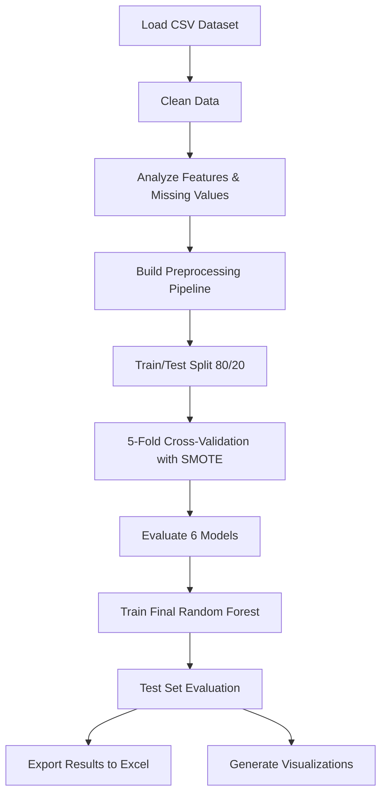

# 🩺 Chronic Kidney Disease Prediction using Machine Learning

A machine learning project for predicting Chronic Kidney Disease (CKD) using multiple classification algorithms, evaluated across three distinct real-world datasets. The pipeline includes full data preprocessing, class imbalance handling via SMOTE, cross-validation, and detailed evaluation with visualization.

---

## 📋 Table of Contents

- [Overview](#overview)
- [Project Structure](#project-structure)
- [Datasets](#datasets)
- [ML Pipeline](#ml-pipeline)
- [Models](#models)
- [Evaluation & Outputs](#evaluation--outputs)
- [Visualizations](#visualizations)
- [Requirements](#requirements)
- [Setup & Usage](#setup--usage)

---

## Overview

Chronic Kidney Disease (CKD) is a long-term condition where the kidneys progressively lose function. Early and accurate detection is critical for timely intervention. This project applies a standardized machine learning pipeline to **three different CKD datasets**, enabling robust cross-dataset evaluation and comparison of six supervised classification models.

Key highlights:
- **Three datasets** processed through the same pipeline for cross-validation comparison
- **Automated preprocessing** with KNN imputation, IQR-based outlier clipping, and adaptive encoding
- **SMOTE** oversampling to handle class imbalance
- **6 classification models** benchmarked via 5-fold Stratified Cross-Validation
- **ROC AUC** analysis on the best-performing model (Random Forest)
- All intermediate and final results exported to Excel

---

## Project Structure

```
Chronic-Kidney-Disease-Prediction/
│
├── code/
│   ├── d1.py            # Pipeline for Dataset 1 (Chronic KIdney Disease dataset.csv)
│   ├── d2.py            # Pipeline for Dataset 2 (chronic_kidney_disease_prepared.csv)
│   └── d3.py            # Pipeline for Dataset 3 (ckd_stages_dataset.csv)
│
├── datasets/
│   ├── Chronic KIdney Disease dataset.csv
│   ├── chronic_kidney_disease_prepared.csv
│   └── ckd_stages_dataset.csv
│
├── power points/        # Presentation slides
├── related works/       # Literature and related research
├── research paper/      # Project research paper
└── README.md
```

---

## Datasets

| # | File | Target Column | Notes |
|---|------|--------------|-------|
| D1 | `Chronic KIdney Disease dataset.csv` | `classification` (`ckd` / `notckd`) | Contains `?` as missing values; `id` column dropped |
| D2 | `chronic_kidney_disease_prepared.csv` | `Class` | Pre-cleaned; `Patient_id` column dropped |
| D3 | `ckd_stages_dataset.csv` | `classification` (`ckd` / `notckd`) | CKD staging data; `id` column dropped |

All datasets contain a mix of **numerical** and **categorical** features related to clinical lab measurements (e.g., blood urea, serum creatinine, hemoglobin, blood pressure, etc.).

---

## ML Pipeline

Each script (`d1.py`, `d2.py`, `d3.py`) runs the same end-to-end pipeline:

```
Raw CSV
   │
   ▼
Data Cleaning
   • Replace "?" → NaN
   • Strip whitespace from column names & values
   • Drop ID columns
   │
   ▼
Feature Analysis
   • Detect numerical vs. categorical features
   • Missing value ratio analysis (threshold: 50%)
   • Columns with ≥50% missing → DROPPED
   • Detect encoding strategy per categorical column
   │
   ▼
Preprocessing (ColumnTransformer)
   ┌────────────────────────────────────────┐
   │ Numerical:                             │
   │   KNNImputer (k=5)                     │
   │   → IQRRemover (factor=1.5, clipping)  │
   │   → StandardScaler                     │
   │                                        │
   │ Categorical (binary):                  │
   │   SimpleImputer (mode)                 │
   │   → OneHotEncoder                      │
   │                                        │
   │ Categorical (multi-class):             │
   │   SimpleImputer (mode)                 │
   │   → OrdinalEncoder                     │
   └────────────────────────────────────────┘
   │
   ▼
Train / Test Split (80/20, stratified)
   │
   ▼
Imbalanced Pipeline (ImbPipeline)
   Preprocessor → SMOTE → Classifier
   │
   ▼
5-Fold Stratified Cross-Validation
   • Accuracy, Precision, Recall, F1 (mean ± std)
   │
   ▼
Final Model Training (Random Forest)
   • Fit on full training set
   • Evaluate on held-out test set
   │
   ▼
Results & Visualization
```

### Custom Component: `IQRRemover`

A sklearn-compatible custom transformer that clips outliers using the **Interquartile Range (IQR)** method instead of dropping rows — making it safe to use inside sklearn/imbalanced-learn Pipelines.

---

## Models

Six classifiers are benchmarked for each dataset:

| Model | Library |
|-------|---------|
| Logistic Regression | `sklearn.linear_model` |
| Support Vector Machine (SVM) | `sklearn.svm` |
| K-Nearest Neighbors (KNN) | `sklearn.neighbors` |
| Decision Tree | `sklearn.tree` |
| **Random Forest** ✅ | `sklearn.ensemble` |
| Gradient Boosting | `sklearn.ensemble` |

> **Random Forest** is used as the final model for test-set evaluation and ROC AUC analysis.

---

## Evaluation & Outputs

All results are saved as Excel files (configured for `E:\AI Project\Excel Sheets\D1|D2|D3\`):

| File | Description |
|------|-------------|
| `X_Before_Preprocessing.xlsx` | Raw feature matrix before any transformations |
| `X_First3_Before_Preprocessing.xlsx` | First 3 rows before preprocessing |
| `X_After_Preprocessing.xlsx` | Feature matrix after full preprocessing |
| `X_First3_After_Preprocessing.xlsx` | First 3 rows after preprocessing |
| `CV_Results.xlsx` | Per-fold and mean accuracy for all 6 models |
| `Train_Metrics_CV.xlsx` | Mean ± std of Accuracy, Precision, Recall, F1 across CV folds |
| `Classification_Report.xlsx` | Final test-set classification report (Random Forest) |

Console outputs include:
- Missing value analysis per column
- Encoding strategy per categorical feature
- CV scores per model
- Train vs. Test accuracy gap (overfitting check)
- Confusion matrix

---

## Visualizations

Each script produces the following plots:

| Plot | Description |
|------|-------------|
| **Boxplots (Before/After)** | Outlier distribution before and after IQR clipping + scaling |
| **Boxplots (Imputed, No Scaling)** | Outliers after KNN imputation only, without standard scaling |
| **Feature Histograms** | Numerical feature distributions before and after preprocessing |
| **SMOTE Class Distribution** | Bar charts of class counts before and after SMOTE balancing |
| **Model Comparison Bar Chart** | Mean CV accuracy comparison across all 6 models |
| **ROC Curve** | ROC-AUC curve for the final Random Forest model on the test set |

---

## Requirements

Install all dependencies via pip:

```bash
pip install pandas numpy matplotlib seaborn scikit-learn imbalanced-learn openpyxl
```

| Package | Purpose |
|---------|---------|
| `pandas` | Data loading and manipulation |
| `numpy` | Numerical operations |
| `matplotlib` | Plotting |
| `seaborn` | Enhanced visualizations |
| `scikit-learn` | ML models, preprocessing, evaluation |
| `imbalanced-learn` | SMOTE oversampling, ImbPipeline |
| `openpyxl` | Excel file export |

**Python version:** 3.8+

---

## Setup & Usage

1. **Clone or download** the repository.

2. **Update dataset paths** in each script to point to the correct CSV locations on your machine:

   ```python
   # d1.py
   path = "path/to/Chronic KIdney Disease dataset.csv"

   # d2.py
   path = "path/to/chronic_kidney_disease_prepared.csv"

   # d3.py
   path = "path/to/ckd_stages_dataset.csv"
   ```

3. **Update Excel output paths** in each script to a writable directory:

   ```python
   cv_df.to_excel(r"path/to/output/CV_Results.xlsx", index=True)
   ```

4. **Run a script:**

   ```bash
   python code/d1.py
   python code/d2.py
   python code/d3.py
   ```

5. **Review outputs** in the configured Excel directory and observe the generated plots.

---

## Workflow Summary



---

## License

This project is developed for academic and research purposes.
